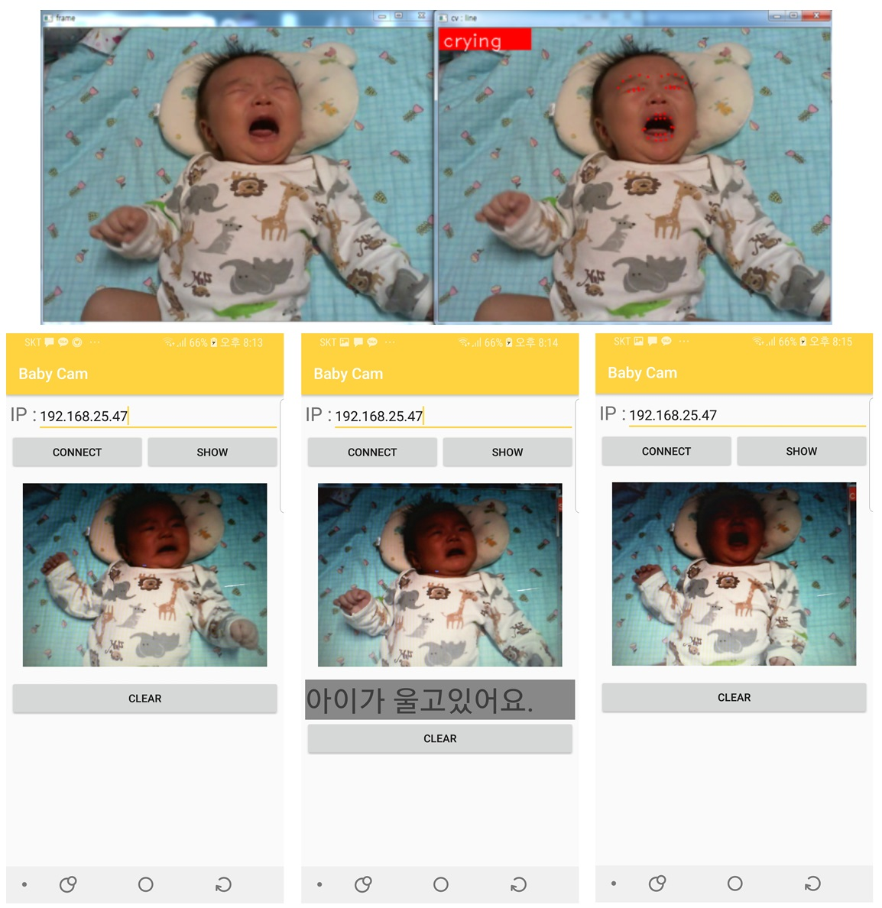

# BabyCam2018

# 기간
    2개월 (2018-10-29 ~ 2018-12-29)
    
    
    
# 개요
    산후조리원의 BabyCam처럼 다른 공간에 있는 아기를 스마트폰으로 볼 수 있는 스트리밍 어플입니다.
    단순한 스트리밍이 아닌 아이의 우는 상태를 검사해 우는 상태를 탐지하면 알려주는 어플입니다.
    
    
    
# 사용한 라이브러리 및 구현 환경
    1. 구현 환경
        - Window 7
        - 라즈베리파이 3 모델 B
        - 라즈비안(linux)
        - Python 3.5
        - opencv 3.4.1
        
    2. 사용한 라이브러리 및 기능
        - face_recognition 라이브러리를 사용한 눈, 입모양 검출
        - UV4L을 사용해 스트리밍
        - Python으로 서버를 구현한 소켓통신

# 필요 기능과 과정
    1. 기능
        - 스트리밍 기능
        - 아이의 눈 크기, 입 크기 검출하는 기능
        - 검출한 결과를 안드로이드로 전송하는 소켓 기능
    2. 우는 상태 검출을 위한 상태 정의
        * 아이의 눈과 입을 검출해 눈과 입의 크기를 기준으로 아이의 우는 상태를 검사하고
          -> 우는 상태가 7초간 지속되면 운다고 가정, 어플에 보이도록 합니다.
        - 아이의 상태를 특정하기 위해 임의로 아래 정보를 기준으로 검출

    

# 구현 화면
    1. 서버를 실행해 클라이언트의 연결을 기다립니다.
    2. 클라이언트에서는 서버의 ip주소를 입력해 서버와 연결합니다.
    3. 현재 실행되고 있는 스트리밍 화면이 나오고, 서버에서 스트리밍 중인 화면에서 아이가 울고
       있는 상태라면 안드로이드로 신호를 보내 아이가 울고 있다는 화면을 보여줍니다.
    4. CLEAR 화면을 누르면 아이가 울고 있다는 표시를 없애줍니다. 

    

   

#  개발 과정은 아래의 블로그에 포스팅 하였습니다.
[**가정용 BabyCam**](https://blog.naver.com/rhrkdfus/221410343689)
